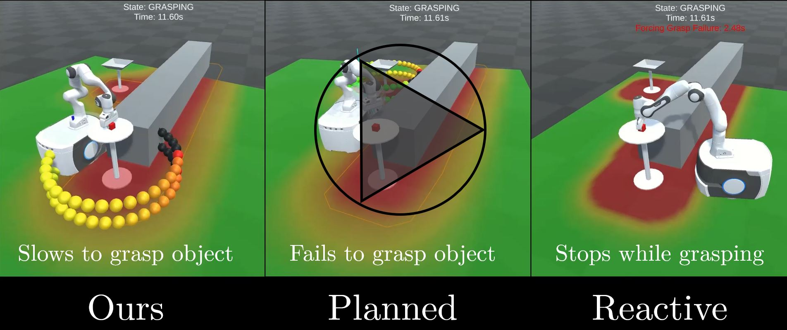
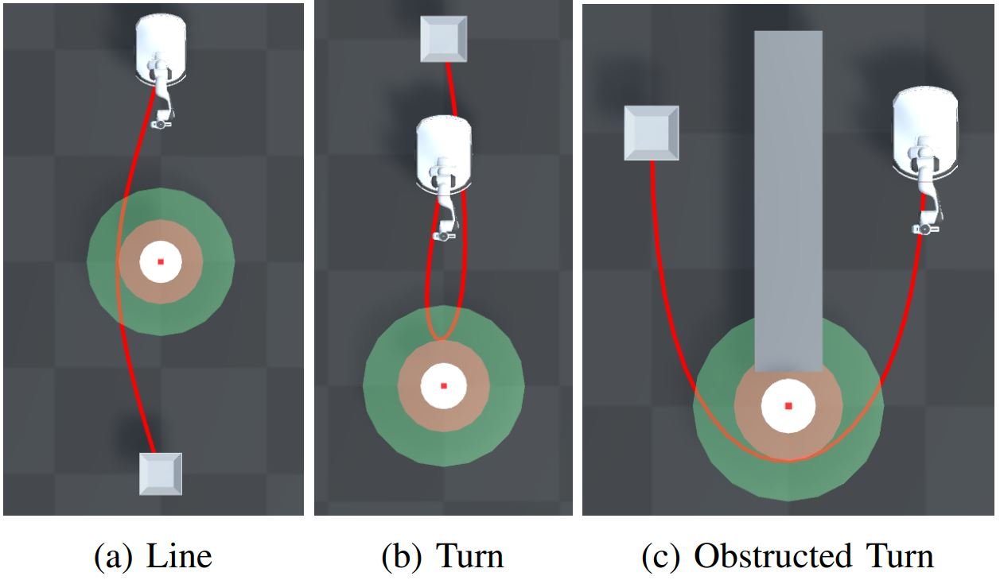
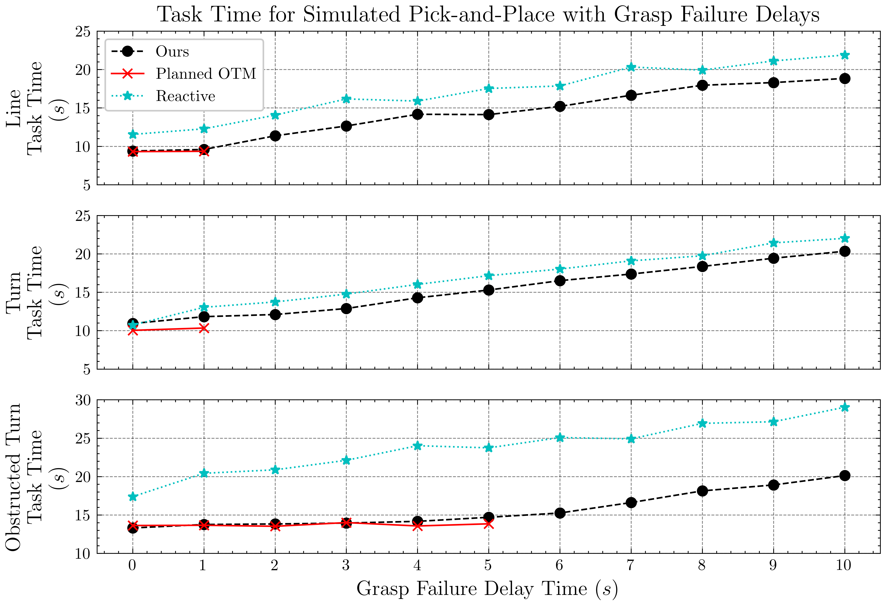

# Enabling Failure Recovery for *On-The-Move* Mobile Manipulation

In [our previous work](https://benburgesslimerick.github.io/ManipulationOnTheMove/) we developed an architecture for enabling mobile manipulators to perform tasks such as grasping and placing without ever coming to a stop. Performing tasks on-the-move introduces new challenges when something goes wrong. For example, if a grasp fails and more time is required for the robot to complete the task, the base should be controlled to keep the object within reach instead of driving off to the drop point without collecting the object. 

In this work we explore a reactive base control system that enables graceful recovery from unexpected delays during manipulation on-the-move tasks. The system continuously evaluates candidate base poses near the target and chooses a goal based on the current state of the robot, location of the immediate target, as well as the next target in a multi-step task. 

A video comparing our proposed method with two baselines on an example task is presented here:

We conduct experiments on three scenarios. In all cases, our method reduces total task time by making as much progress as possible towards the drop point, while still ensuring that the object is kept within reach until the grasp is completed. 

 

 

## Experiments

We considered three pick-and-place tasks where an object must be grasped from one location, and transported to another. A top-down view of the three scenarios is shown below. The configurations of pick and place locations reflect common scenarios in real-world tasks. 

We compare our method with two baseline approaches that are representative of existing methods in mobile manipulation. The first uses a planned trajectory for the base that performs grasps on-the-move, but does not slow down in the event of grasp failure. The second baseline is designed around the Timed Elastic Bands implementation provided in the ROS navigation stack, and does not attempt to perform manipulation on-the-move. 

For each task, we simulate grasp failure delays of varying lengths between 0 and 10 seconds, and record the total time take to complete the task. The results are presented below. For analysis please see the paper. 

### Experiment Videos

Videos of the individual experiment trials are available [here](https://drive.google.com/drive/folders/1p97jnsC0tft-BSnOH3wX_PHPcJZucZnY?usp=sharing). 
<!-- #### Line Scenario
| Method | No Delay | 1s | 2s | 3s | 4s | 5s | 6s | 7s | 8s | 9s | 10s |
| ------ | -------- | -- | -- | -- | -- | -- | -- | -- | -- | -- | --- |
| Ours   | | | | | | | | | | | | 
| Planned |  | | | | | | | | | |
| Reactive | | | | | | | | | | |   -->